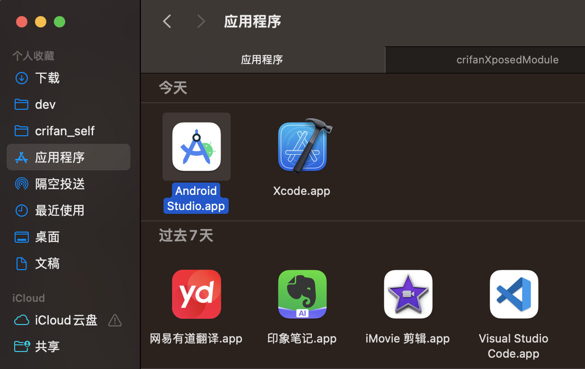

# Android Studio

TODO：

把相关多个帖子内容整理过来

* 【已解决】Android Studio中左边项目文件列表如何跳转切换到当前打开的文件
* 【已解决】Android中用preference-v7后编译报错：values-v26.xml AAPT error resource android attr colorError not found
* 【已解决】Android中context的startService对应的service运行机制
* 【未解决】通过Android Studio打开调试设置Java Exception Breakpoints和Exception Breakpoints看看能否找到rcsjta中rcs的core的service如何启动的逻辑
* 【记录】Android Studio根据提示升级到最新4.0.1版本和更新其他内容
* 【已解决】rcsjta的RI运行报错：java.lang.SecurityException Not allowed to bind to service Intent

---

* `Android Studio`
  * 简称：`AS`

## 下载和安装

从Android Studio的官网的[下载页面](https://developer.android.com/studio)去下载到和当前电脑匹配的安装包，去安装即可。

比如，此处`Mac M2 Max`匹配的是`Apple Silicon`的`Android Studio Flamingo | 2022.2.1 Patch 2`的安装包：

`android-studio-2022.2.1.20-mac_arm.dmg`


双击后，弹框中，把`Android Studio.app`拖动到`应用程序`，即可实现安装：



之后即可双击应用程序中的`Android Studio.app`启动`AS`，双击启动，进行初始化配置

期间需要注意的一点是，最好是，已有代理工具，且此处`HTTP Proxy`从默认的`No Proxy`改为`Auto-detect proxy settings`：


这样可以加速后续的google资源的下载。

初始化配置后，即可进入主页面：


此处相关版本信息是：

```bash
Android Studio Flamingo | 2022.2.1 Patch 2
Build #AI-222.4459.24.2221.10121639, built on May 12, 2023
Runtime version: 17.0.6+0-17.0.6b802.4-9586694 aarch64
VM: OpenJDK 64-Bit Server VM by JetBrains s.r.o.
macOS 13.2.1
GC: G1 Young Generation, G1 Old Generation
Memory: 1280M
Cores: 12
Metal Rendering is ON
Registry:
    external.system.auto.import.disabled=true
    ide.text.editor.with.preview.show.floating.toolbar=false
    gradle.version.catalogs.dynamic.support=true

Non-Bundled Plugins:
    com.developerphil.adbidea (1.6.9)
```

## AS快捷键

* 跳转到文件开始/末尾
  * `Win`：`Ctrl`+`Home`/`End`
  * `Mac`：`Ctrl`+`Fn`+`Left`/`Right`
    * 注：`Mac`中没有`Home`/`End`
      * 有等价的：`Fn`+`Left`/`Right`
        * `Fn`+`Left`=`Home`
        * `Fn`+`Right`=`End`

## gradle

TODO：

* 【已解决】Mac中Android Studio下载gradle的zip包速度太慢
* 【已解决】Mac中Android Studio中gradle的库下载速度慢
* 【已解决】Android Studio中gradle编译的项目如何加参数：-Xlint:unchecked
* 【已解决】Android Studio中gradle报错：ERROR Cause compileSdkVersion is not specified
* 【已解决】Android中gradle编译报错：This project uses AndroidX dependencies, but the android.useAndroidX property is not enabled

自动化编译过程

安卓编译过程：


-》手动去操作，很复杂

-》所以一般会需要`build`=`构建`工具实现自动化编译过程

安卓的构建工具有

* 最早的：`Ant`
* 后来的=现在主流的：`Gradle`
* 最新的：`Buck`
  * 来自`Facebook`

开发安卓的IDE是：`Android Studio`

其现在已内置支持`Gradle`，会自动帮忙调用Gradle去编译你的apk

但是其内部过程你是不清楚的，所以最好学学Gradle，搞清楚过程。

## AS调试

### AS调试时就是调用的`adb shell am start`

之前就有了解过

```bash
adb shell am start
```

现在发现，Android Studio去调试时，内部实现也就是调用了：

```bash
08/12 14:15:57: Launching 'core' on Xiaomi Redmi Note 8 Pro.
$ adb shell am start -n "com.gsma.rcs/com.gsma.rcs.provisioning.local.Provisioning" -a android.intent.action.MAIN -c android.intent.category.LAUNCHER -D
```


