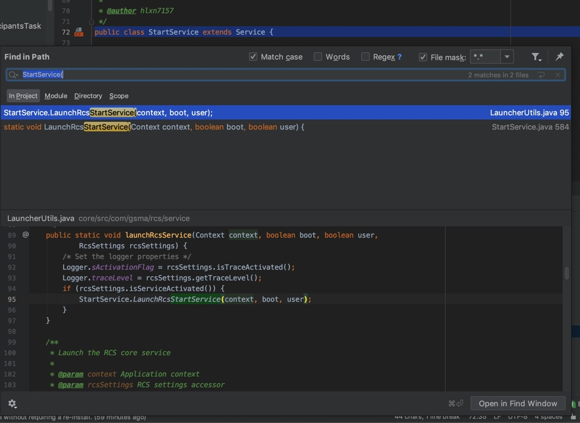
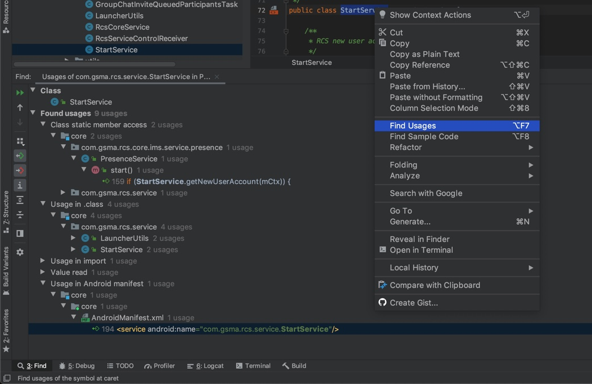
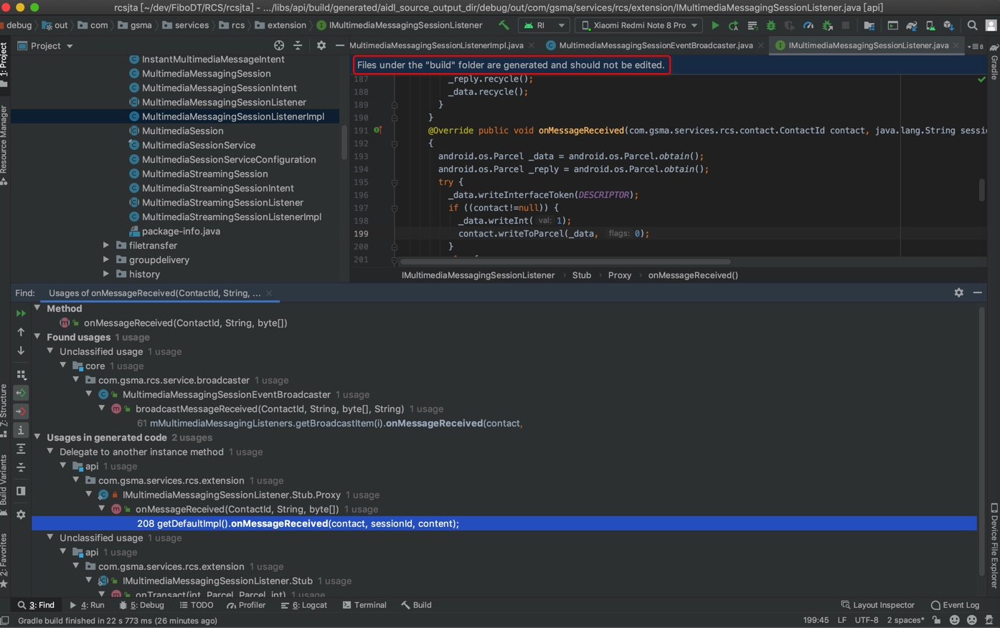

# AS智能之处

基于IntelliJ IDEA的Android Studio的智能之处

`Android Studio`是基于`IntelliJ IDEA`的。

而`IntelliJ IDEA`是`Java`的`IDE`，以智能著称。

下面记录遇到的，觉得智能的地方

## 用`Find Usages`去查找被调用地方，而不要仅仅用搜索

对于

`src/com/gsma/rcs/service/StartService.java`

的：

```java
public class StartService extends Service {
```

想要去找有哪些地方调用了。

结果搜：

`StartService(`

只找到2处：



其实是没有真正找到被调用的地方。

而后来想起来了，换用：`Find Usages`



就可以找到，真正被调用的多处地方。

是效率更高，更准确的。

即Find Usages还是很准很好用的。

## 自动识别build目录下的文件

打开一个java文件，自动提示：

```bash
Files under the build folder are generated and should not be edited
```



此处文件路径是：

`build/generated/aidl_source_output_dir/debug/out/com/gsma/services/rcs/extension/IMultimediaMessagingSessionListener.java`

即：

在`build`目录下的文件，是（项目源码编译后）生成的，不应该被编辑

即：提示你，不要在这里编译，而应该去找源码编辑

很是智能，防止你不小心浪费了时间在编译生成的地方修改代码。
