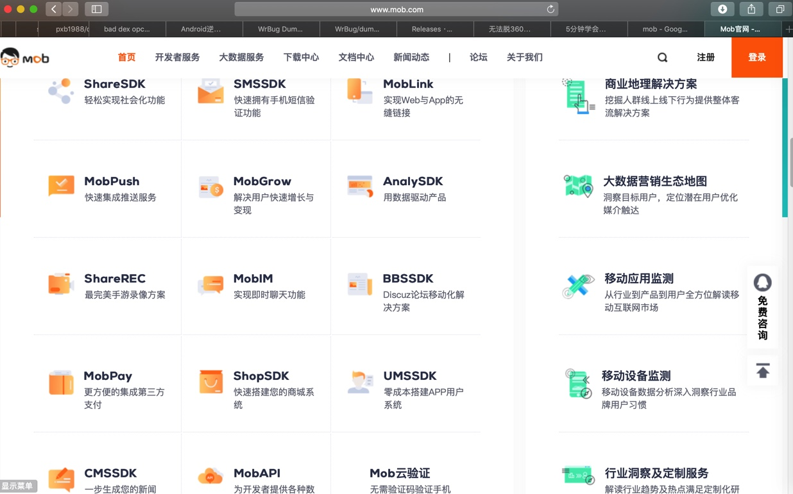

# Android常用库

Android中常用的一些库：

* LitePal
  * 作用：方便操作SQLite
  * 仓库
    * https://github.com/LitePalFramework/LitePal
      * LitePalFramework/LitePal: An Android library that makes developers use SQLite database extremely easy.
  * 举例：
    * 小花生的安卓app中用LitePal操作SQLite
* anko
  * 库
    * Kotlin/anko: Pleasant Android application development
      * https://github.com/Kotlin/anko
  * 资料
    * [使用 Kotlin 和 Anko 的安卓开发入门](https://academy.realm.io/cn/posts/getting-started-with-kotlin-and-anko/)
  * 作用：方便安卓布局，无需用繁琐的xml去布局
    * 类似于iOS的
      * swift中的Cartography
        * https://github.com/robb/Cartography
          * robb/Cartography: A declarative Auto Layout DSL for Swift
      * 或其他的比如：PureLayout
        * https://github.com/PureLayout/PureLayout
          * PureLayout/PureLayout: The ultimate API for iOS & OS X Auto Layout — impressively simple, immensely powerful. Objective-C and Swift compatible.
  * 举例
    * 小花生安卓版
* okio
  * 仓库
    * https://github.com/square/okio
      * square/okio: A modern I/O API for Java
  * 作用：方便数据操作
  * 举例
    * 小花生安卓版
      * 其中用到的okhttp依赖于okio
* okhttp
  * okhttp3
    * 作用：http网络库
    * 仓库
      * https://github.com/square/okhttp
        * square/okhttp: An HTTP+HTTP/2 client for Android and Java applications.
    * 举例：
      * 趣配音安卓版
      * 小花生安卓版
* afinal
  * 作用：Afinal 是一个android的sqlite orm 和 ioc 框架。同时封装了android中的http框架，使其更加简单易用
  * 仓库
    * yangfuhai/afinal: Afinal是一个android的ioc，orm框架：
      * 方便通过注解的方式进行绑定ui和事件
      * 方便的加载bitmap图片
      * 方便操作SQLite
      * 方便以ajax形式请求http数据
    * https://github.com/yangfuhai/afinal
  * 举例：
    * 小花生安卓版
* PermissionGen
  * 作用：方便申请权限
    * 背景：android在6.0系统以后，权限申请变得麻烦起来，所以用库去方便权限申请
  * 代码仓库
    * https://github.com/lovedise/PermissionGen
      * lovedise/PermissionGen: Android API easy to use permission for Android M
  * 举例：
    * 小花生安卓版
* mob
  * 功能：
    * 社交分享、短信验证、深度链接、统计分析、推送等
    * Mob依托开发者服务，构建全景数据生态，挖掘大数据的价值
    * 
    * 比如：
      * ShareSDK
        * 仓库：
          * https://github.com/MobClub/ShareSDK-for-Android
      * smssdk
  * 主页：http://www.mob.com
* loopj
  * 作用：异步http库
  * 仓库
    * https://github.com/loopj/android-async-http
      * loopj/android-async-http: An Asynchronous HTTP Library for Android
  * 举例
    * 小花生安卓版
* xutil
  * 作用：http网络库
  * 仓库：
    * https://github.com/wyouflf/xUtils3
      * wyouflf/xUtils3: android orm, bitmap, http, view inject...
  * 举例：
    * 小花生安卓版
    * [［已解决］xutils3如何实现http的put请求request](http://www.crifan.com/android_xutils_3_implement_http_put_request)
* gson
  * 作用：处理json
  * 仓库：
    * https://github.com/google/gson
      * google/gson: A Java serialization/deserialization library to convert Java Objects into JSON and back
  * 举例：
    * 小花生安卓版
* zxing
  * 作用：处理二维码
  * 仓库：
    * https://github.com/zxing/zxing
      * zxing/zxing: ZXing ("Zebra Crossing") barcode scanning library for Java, Android
  * 举例：
    * 小花生安卓版
* subsampling-scale-image-view
  * 作用：图片缩放处理显示
  * 仓库
    * https://github.com/davemorrissey/subsampling-scale-image-view
      * davemorrissey/subsampling-scale-image-view: Android library (AAR). Highly configurable, easily extendable deep zoom view for displaying huge images without loss of detail. Perfect for photo galleries, maps, building plans etc.
  * 举例
    * 小花生安卓版
* PhotoPick-Master
  * 作用：图片选择
  * 仓库：
    * https://github.com/Awent/PhotoPick-Master
      * Awent/PhotoPick-Master: A photo pick, clip, view larger image tool. and you can define some parameter
* android-pickers
  * 作用：选择器
  * 仓库：
    * https://github.com/addappcn/android-pickers
      * addappcn/android-pickers: 安卓选择器类库
