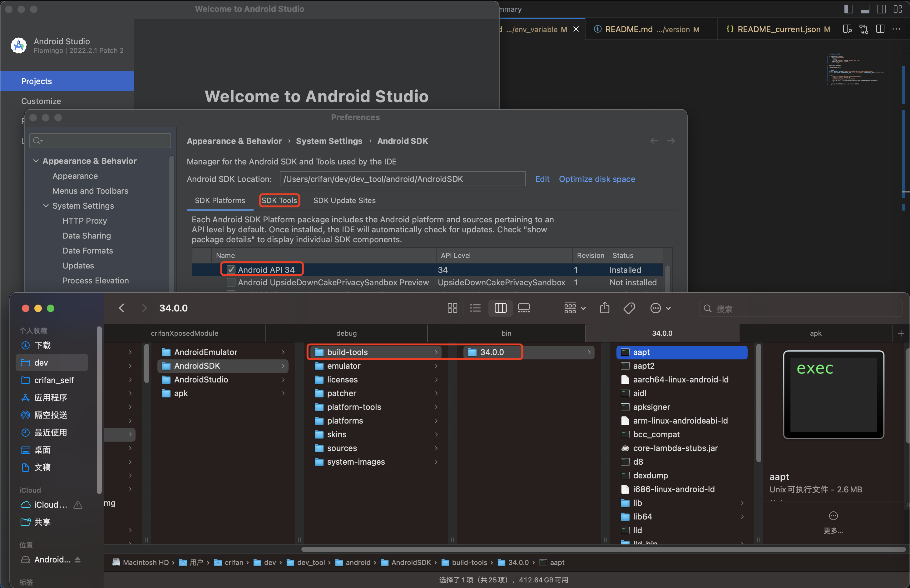

# Android环境变量

* Android相关环境变量
  * 旧的：`ANDROID_HOME`
    * 已废弃
      * 为了兼容，目前也还支持`ANDROID_HOME`而已
  * 新的改用：`ANDROID_SDK_ROOT`
    * 建议用新的

如何设置环境变量：

把下面的变量定义：

```bash
export ANDROID_SDK_ROOT=/Users/crifan/dev/dev_tool/android/AndroidSDK/
export ANDROID_HOME=$ANDROID_SDK_ROOT
export PATH=$PATH:$ANDROID_SDK_ROOT/build-tools/34.0.0:$ANDROID_SDK_ROOT/platform-tools
```
* 其中
  * `/Users/crifan/dev/dev_tool/android/AndroidSDK/`
    * 是我当前`Android SDK`的位置
  * `$ANDROID_SDK_ROOT/build-tools/34.0.0`
    * 其中的`34.0.0`是对应的，已下载好的，当前Android的SDK的Build-tools的版本
      * 

加到启动脚本，比如此处`Mac`中的`~/.zshrc`即可。
